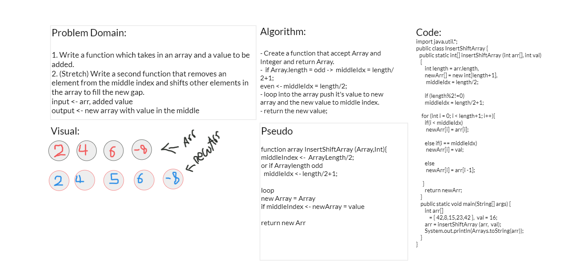
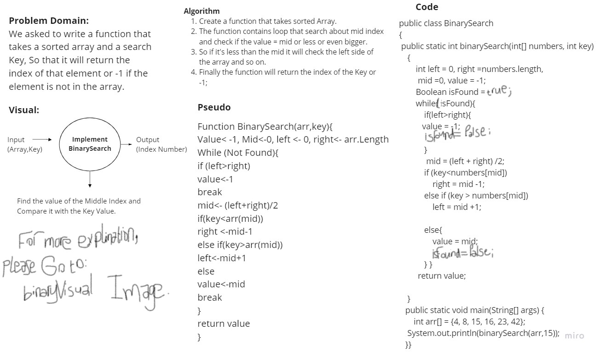

# 401-data-structures-and-algorithms

## Table of contents

  

| title       | Link to The challenge       | Link to The Code                 |         
| ------------|-----------------------------|----------------------------------|
|array-reverse|[Directory](challenges/reverse)|[Reverse](challenges/reverse/reverse.png)|
|insert-shift|[Directory](challenges/insert)|[Insert](challenges/insert/insert.png)|
|binary-search|[Directory](challenges/binarySearch)|[Insert](challenges/binarySearch/binarySearch.jpg)|

# 1. Reverse an Array
<!-- Description of the challenge -->
We need to reverse array

Input - > Array

OutPut -> Reversed Array

# 2. Insert
We need to Insert value in the middle of the array

Input - > Array

OutPut -> Array new Value in the middle

# 2. Binary Search
We need to create a function that implements binary search:

Input - > a sorted array, and the search key.

OutPut -> The index of the array’s element that is equal to the value of the search key,
or -1 if the element is not in the array.

## Whiteboard Process
<!-- Embedded whiteboard image -->
### (1)

### (2)

### (3)

## Approach & Efficiency
<!-- What approach did you take? Discuss Why. What is the Big O space/time for this approach? -->
