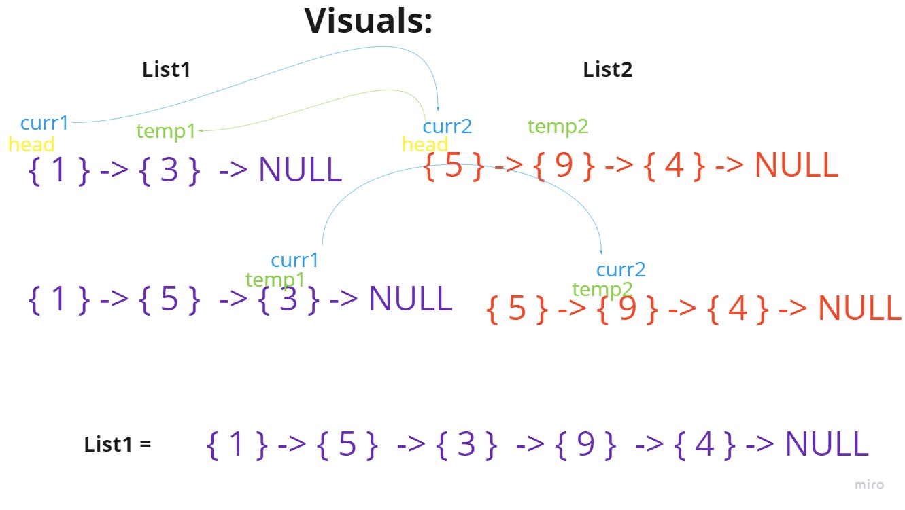
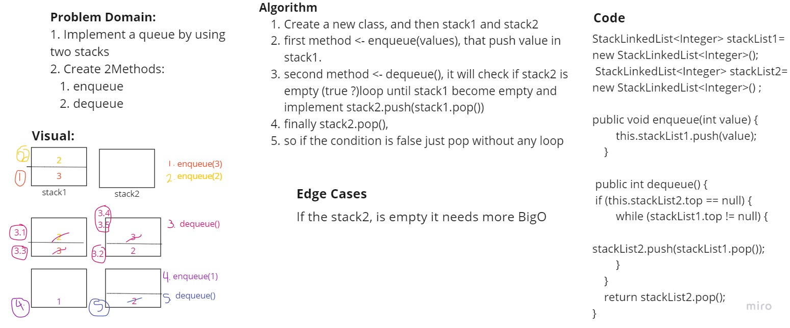

# 401-data-structures-and-algorithms

## Table of contents

  

| title       | Link to The challenge       | Link to The Code                 |         
| ------------|-----------------------------|----------------------------------|
|array-reverse|[Directory](challenges/reverse)|[Reverse](challenges/reverse/reverse.png)|
|insert-shift|[Directory](challenges/insert)|[Insert](challenges/insert/insert.png)|
|binary-search|[Directory](challenges/binarySearch)|[layout](challenges/binarySearch/binarySearch.jpg) And [binaryVisual](challenges/binarySearch/binaryVisual.jpg)|
|linked-list|[Directory](challenges/linked)| [LL](challenges/linked/app/src/main/java)|
|linked-list-zip|[Directory](challenges/stackQueue)|[linked-list-zip](challenges/linked/app/src/main/resources)|
|Stack & Queue|[Directory](challenges/stackQueue)| [Stack&Queue](challenges/stackQueue/app/src/main/java)|
|stack-queue-pseudo|[Directory](challenges/stackQueue)|[stack-queue-pseudo](challenges/stackQueue/app/src/main/resources)|

# 1. Reverse an Array
<!-- Description of the challenge -->
We need to reverse array

Input - > Array

OutPut -> Reversed Array

# 2. Insert
We need to Insert value in the middle of the array

Input - > Array

OutPut -> Array new Value in the middle

# 3. Binary Search
We need to create a function that implements binary search:

Input - > a sorted array, and the search key.

OutPut -> The index of the array’s element that is equal to the value of the search key,
or -1 if the element is not in the array.

# 5.Singly Linked List
Singly linked lists contain nodes which have a data field as well as 'next' field, which points to the next node in line of nodes.

## Challenge
1. A Node class that has properties for the value stored in the Node, and a pointer to the next Node.
2. LinkedLink Class, that contains:
- A head property.
- Insert method -> Adds a new node In the beginning of the LinkedList.
- Includes method -> Indicates whether that value exists as a Node’s value somewhere within the list.
- to string -> Returns: a string representing all the values in the Linked List, formatted as:
"{ a } -> { b } -> { c } -> NULL"

# 6.Singly Linked List Insertions
To LinkedLink Class, Thses methods are added:
1. Append -> adds a new node with the given value to the end of the list
2. Insert before -> adds a new node with the given new value immediately before the first node that has the value specified
3. Insert after -> adds a new node with the given new value immediately after the first node that has the value specified.

## Solution
<!-- Show how to run your code, and examples of it in action -->
To run this code, type App.java the method with the arguments needed, then print.
list.insertAtEnd(value)
list.insertAfter(value, newvalue);
list.insertBefore(value, newvalue);

# 7.Singly Linked List ->kth from end function
Using this method you can insert the index, and it will return the value within that index or error messege of the index is out of the range.

# 8.Singly Linked List ->zip lists function
This function take 2 linked lists and return them as a one link list(zipped).

# 10.Stack and a Queue Implementation
# Stacks and Queues
<!-- Short summary or background information -->
- **Stack** contains objects that are pushed and popped according to the last-in first-out (LIFO) principle.
- **Queue** contains objects that are enqueued and dequeued according to the first-in first-out (FIFO) principle.

## Challenge
<!-- Description of the challenge -->
Using a Linked List, Implement both a Stack, and a Queue:  
1. ### a Node class ->  
   has properties for the value stored in the Node, and a pointer to the next node.  
2. ### Stack  
- The class methods:  
- **push**  
Arguments: value  
adds a new node with that value to the top of the stack with an O(1) Time performance.  
- **pop**  
Arguments: none
Returns: the value from node from the top of the stack
Removes the node from the top of the stack  
- **peek**  
Arguments: none  
Returns: Value of the node located at the top of the stack  
- **is empty**  
Arguments: none  
Returns: Boolean indicating whether the stack is empty.  
  
### Queue

The class methods:
- **enqueue**  
Arguments: value  
adds a new node with that value to the back of the queue with an O(1) Time performance.  
- **dequeue**
Arguments: none  
Returns: the value from node from the front of the queue  
Removes the node from the front of the queue  
- **peek**
Arguments: none  
Returns: Value of the node located at the front of the queue  
- **is empty**  
Arguments: none
Returns: Boolean indicating whether the queue is empty

# 11. Stack Queue Pseudo

## Challenge Summary
<!-- Description of the challenge -->
1. Implement a queue by using two stacks
2. Create 2Methods:
   1. enqueue
   - Inserts value into the PseudoQueue, using a first-in, first-out approach.
   2. dequeue
   - Extracts a value from the PseudoQueue, using a first-in, first-out approach.h

## Approach & Efficiency
<!-- What approach did you take? Why? What is the Big O space/time for this approach? -->
1. Enqueue it is O(1), by pushing to stack1 immediately.
2. Dequeue it is O(n), by popping each element from stack1 and pop it to stack2(if stack 2 was empty), then pop from stack2.
and O(1) in the case that stack2 was not empty by popping immediately.

## Solution
<!-- Show how to run your code, and examples of it in action -->
It described in the previous node,
so to run it you need to Enqueue(value) or Dequeue.

----

## Whiteboard Process
<!-- Embedded whiteboard image -->

### (1)

### (2)

### (3)

 

## (8)

## (11)
 

## Approach & Efficiency
<!-- What approach did you take? Discuss Why. What is the Big O space/time for this approach? -->
