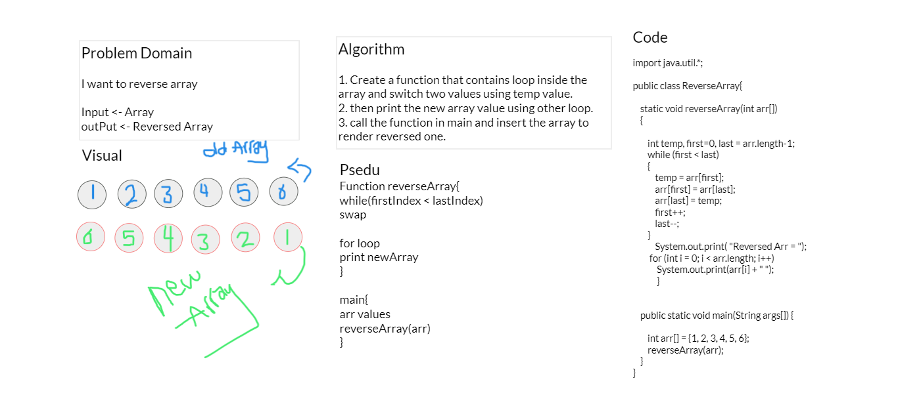

# 401-data-structures-and-algorithms

## Table of contents

  

| title       | Link to The challenge       | Link to The Code                 |         
| ------------|-----------------------------|----------------------------------|
|array-reverse|[Dir](challenges/reverseArr) |[Reverse](challenges/reverse/reverse.png)|
|array-insert-shift|[Directory](challenges/insert) |[Image](challenges/insert/insert.png) |

# 1. Reverse an Array
<!-- Description of the challenge -->
We need to reverse array
Input - > Array
OutPut -> Reversed Array

# 2. Insert
We need to Insert value in the middle of the array
Input - > Array
OutPut -> Array new Value in the middle

## Whiteboard Process
<!-- Embedded whiteboard image -->

## Approach & Efficiency
<!-- What approach did you take? Discuss Why. What is the Big O space/time for this approach? -->
