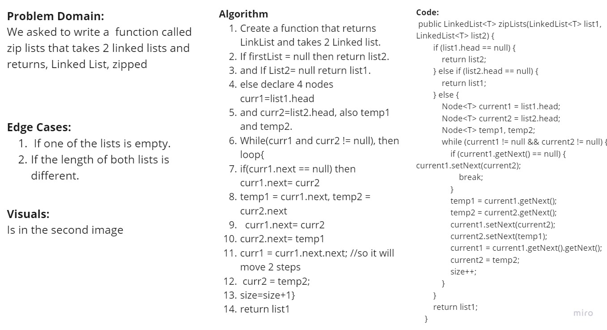

# 5.Singly Linked List
Singly linked lists contain nodes which have a data field as well as 'next' field, which points to the next node in line of nodes.

## Challenge
1. A Node class that has properties for the value stored in the Node, and a pointer to the next Node.
2. LinkedLink Class, that contains:
- A head property.
- Insert method -> Adds a new node In the beginning of the LinkedList.
- Includes method -> Indicates whether that value exists as a Node’s value somewhere within the list.
- to string -> Returns: a string representing all the values in the Linked List, formatted as:
"{ a } -> { b } -> { c } -> NULL"

# 6.Singly Linked List Insertions
To LinkedLink Class, Thses methods are added:
1. Append -> adds a new node with the given value to the end of the list
2. Insert before -> adds a new node with the given new value immediately before the first node that has the value specified
3. Insert after -> adds a new node with the given new value immediately after the first node that has the value specified.

## Solution
<!-- Show how to run your code, and examples of it in action -->
To run this code, type App.java the method with the arguments needed, then print.
list.insertAtEnd(value)
list.insertAfter(value, newvalue);
list.insertBefore(value, newvalue);

# 7.Singly Linked List ->kth from end function
Using this method you can insert the index, and it will return the value within that index or error messege of the index is out of the range.

# 8.Singly Linked List ->zip lists function
This function take 2 linked lists and return them as a one link list(zipped).

## Whiteboard Process
<!-- Embedded whiteboard image -->

