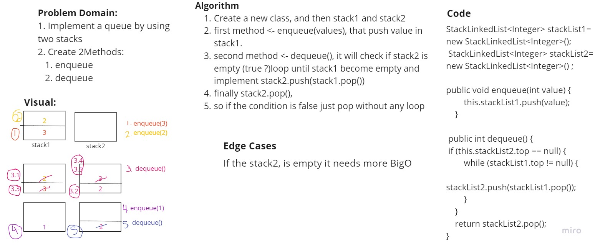
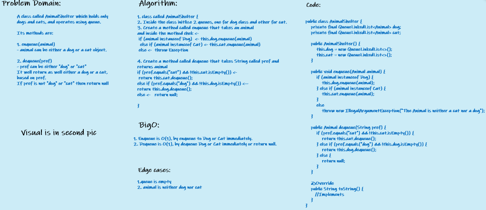
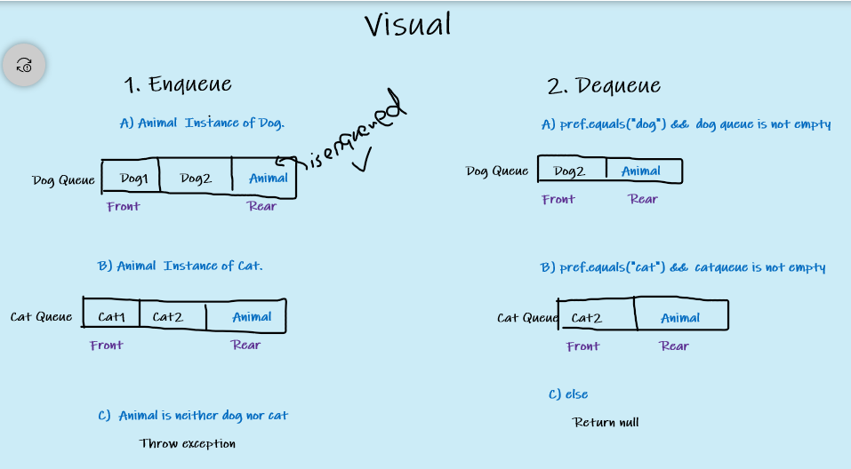
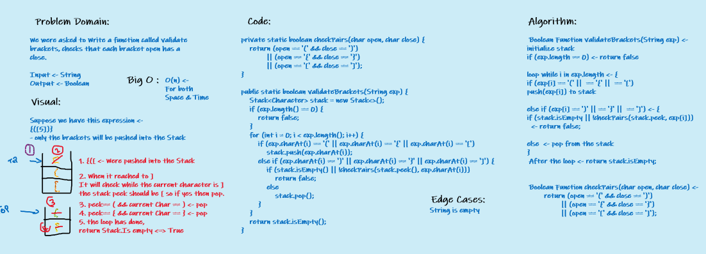

# 10.Stack and a Queue Implementation
# Stacks and Queues
<!-- Short summary or background information -->
- **Stack** contains objects that are pushed and popped according to the last-in first-out (LIFO) principle.
- **Queue** contains objects that are enqueued and dequeued according to the first-in first-out (FIFO) principle.

## Challenge
<!-- Description of the challenge -->
Using a Linked List, Implement both a Stack, and a Queue:  
1. ### a Node class ->  
   has properties for the value stored in the Node, and a pointer to the next node.  
2. ### Stack  
- The class methods:  
- **push**  
Arguments: value  
adds a new node with that value to the top of the stack with an O(1) Time performance.  
- **pop**  
Arguments: none
Returns: the value from node from the top of the stack
Removes the node from the top of the stack  
- **peek**  
Arguments: none  
Returns: Value of the node located at the top of the stack  
- **is empty**  
Arguments: none  
Returns: Boolean indicating whether the stack is empty.  
  
### Queue

The class methods:
- **enqueue**  
Arguments: value  
adds a new node with that value to the back of the queue with an O(1) Time performance.  
- **dequeue**
Arguments: none  
Returns: the value from node from the front of the queue  
Removes the node from the front of the queue  
- **peek**
Arguments: none  
Returns: Value of the node located at the front of the queue  
- **is empty**  
Arguments: none
Returns: Boolean indicating whether the queue is empty

# 11. Stack Queue Pseudo

## Challenge Summary
<!-- Description of the challenge -->
1. Implement a queue by using two stacks
2. Create 2Methods:
   1. enqueue
   - Inserts value into the PseudoQueue, using a first-in, first-out approach.
   2. dequeue
   - Extracts a value from the PseudoQueue, using a first-in, first-out approach.h

## Approach & Efficiency
<!-- What approach did you take? Why? What is the Big O space/time for this approach? -->
1. Enqueue is O(1), by pushing to stack1 immediately.
2. Dequeue is O(n), by popping each element from stack1 and pop it to stack2(if stack 2 was empty), then pop from stack2.
and O(1) in the case that stack2 was not empty by popping immediately.

## Solution
<!-- Show how to run your code, and examples of it in action -->
It described in the Summary,
so to run it you need to Enqueue(value) or Dequeue.

----
# 12. Stack Queue Animal Shelter

## Challenge Summary
<!-- Description of the challenge -->
1. **Dog & Cat classes** Implements Animal Interface.
2. **AnimalShelter Class** holds only dogs and cats.
3. The shelter operates using Queue.
2. The 2Methods Inside AnimalShelter Class :
   1. enqueue
   - Arguments: animal, and **animal** can be either a dog or a cat object
   2. dequeue
   - Arguments: pref, and pref can be either "dog" or "cat".
   - Return: either a dog or a cat, based on preference.
   - If pref is not "dog" or "cat" then return null.

## Approach & Efficiency
<!-- What approach did you take? Why? What is the Big O space/time for this approach? -->
1. Enqueue is O(1), by enqueue to Dog or Cat immediately.
2. Dequeue is O(1), by dequeue Dog or Cat immediately or return null.

## Solution
<!-- Show how to run your code, and examples of it in action -->
To run it you need to Enqueue(value) or Dequeue.

---
# 13. Stack Queue Brackets

## Challenge Summary

- Function Called **validateBrackets**, that take string and return boolean.
- So it checks for the 3 types of brackets, 
  and return true if the brackets in the string are balanced or false if they are not.

## Approach & Efficiency
<!-- What approach did you take? Why? What is the Big O space/time for this approach? -->

- Big O time -> O(n) because we are looping inside the string character by character.

- Big O space -> O(n) because the method is taking a String.

## Solution
<!-- Show how to run your code, and examples of it in action -->
To run it you need to insert any string you want

## Whiteboard Process
<!-- Embedded whiteboard image -->

## (11)

## (12)

## (13)

