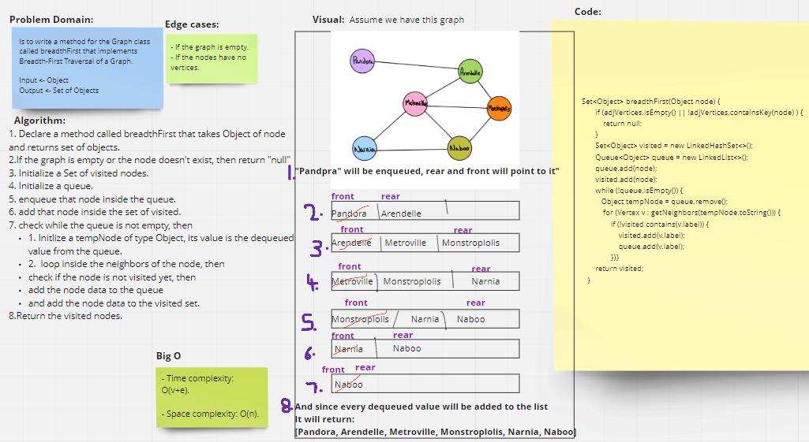
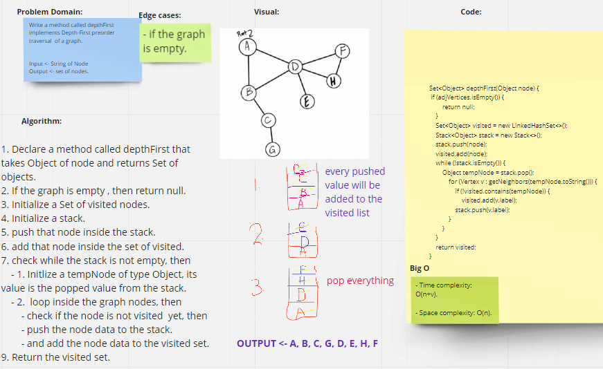

# 35. Graph
A graph is data structure consisting of data that is stored among many groups of edges and vertices. 

## Challenge
- **We asked to implement Graph by Creating 2 classes with their basic methods:**
1. **Vertex class**
2. **Graph Class**

## [Link to the code](../challenges/graph/app/src/main/java/graph/Graph.java)

## [Link to the test](../challenges/graph/app/src/test/java/graph/GraphTest.java)

## Approach & Efficiency
1. **addNode** mehod ->
- Space Complexity: O(n)
- Time Complexity: O(1)

2. **addEdge** mehod -> 
- Space Complexity: O(n)
- Time Complexity: O(1)

3. **getNodes** method -> 
- Space Complexity: O(n)
- Time Complexity: O(1)

4. **getNeighbors** method ->
- Space Complexity: O(1)
- Time Complexity: O(1)

5. **size** method -> 
- Space Complexity: O(1)
- Time Complexity: O(1)

## API
### Graph Class Methods:
1.  **addNode(String value)** ->  Add a node to the graph and returns the added node value.
2.  **addEdge(String data1, String data2)** -> Adds a new edge between two nodes in the graph.
3. **getNodes()** -> returns all the nodes in the graph as a set collection.
4. **getNeighbors()** -> Returns a collection of edges connected to the given node.
5. **size()** -> Returns the total number of nodes in the graph

---
# 36. Implement Breadth-First Traversal of a Graph.

## Challenge Summary
<!-- Description of the challenge -->
Write a method for the Graph class called **breadthFirst** that implements Breadth-First Traversal of a Graph.

**Arguments:**  String of Node  
**Return:** A collection of nodes in the order they were visited. 

  
## [Link to the code](../challenges/graph/app/src/main/java/graph/Graph.java)

## [Link to the test](../challenges/graph/app/src/test/java/graph/GraphBreadthFirstTest.java)

## Whiteboard Process
<!-- Embedded whiteboard image -->

  
## Approach & Efficiency
<!-- What approach did you take? Why? What is the Big O space/time for this approach? -->
### - Approach:
1. Declare a method called **breadthFirst** that takes Object of node and returns Set of objects.
2. If the **graph is empty** or the **node doesn't exist**, then return **"null"**.
3. Initialize a Set of **visited** nodes.
4. Initialize a **queue**.
5. **enqueue** that node inside the queue.
6. add that node inside the set of visited.
7. check while the queue is not empty, then
    - 1. Initlize a **tempNode** of type Object, its value is the **dequeued** value from the queue.
    - 2.  loop inside the graph nodes, then
        - check if the node **is not visited** yet, then
        - add the node data to the queue.
        - and add the node data to the visited set.
9. Return the **list**.
  

### - Efficiency:
- **Space complexity** -> O(n).

- **Time complexity** -> O(v+e), where v is vertices and e is for edges.

  
## Solution
<!-- Show how to run your code, and examples of it in action -->
- Initialize A variable from **Graph Class**.
- then call the **breadthFirst(node)** method.

---
# 37. Business trip

## Challenge Summary
<!-- Description of the challenge -->
Given a business trip itinerary, and an Alaska Airlines route map, is the trip possible with direct flights? If so, how much will the total trip cost be?

Write a method for the Graph class called **businessTrip** that determines whether the trip is possible with direct flights, and how much it would cost.

**Arguments:**  graph, List of city names  
**Return:** String (cost or null).

  
## [Link to the code](../challenges/graph/app/src/main/java/graph/Graph.java)

## [Link to the test](../challenges/graph/app/src/test/java/graph/BusinessTripTest.java)

## Whiteboard Process
<!-- Embedded whiteboard image -->

  
## Approach & Efficiency
<!-- What approach did you take? Why? What is the Big O space/time for this approach? -->
### - Approach:
#### **First method Algorithm:**
1. Declare a private method called **findWeight** that takes graph, string of city1, and string of city2, and returns integer value.
2.  loop inside the neighbor vertices of the city1, then
    - check if the vertex value is same as city2, then
        - return the vertex weight value.
3. return zero.

#### **Second method Algorithm:**
1. Declare a method called **businessTrip** that takes graph, and List of cities names, and returns String (cost or null).
2. Initialize a cost variable with a zero as an initial value.
3. check if the size of the citiesNames list is less or equal one, then return null.
4. Declare integer value for the weight.
5. loop from 0 to the size of the citiesNames list
    - give the weight the returned value of find weight method when it takes the graph, the city of that index and the city that after it.
    - check if weight value equals zero then,
        - return **"False, $0"**
    - give the cost the sum of weight values
6. return **"True, $" + cost**
  

### - Efficiency:
- **Space complexity** -> O(1).

- **Time complexity** -> O(n^2).

  
## Solution
<!-- Show how to run your code, and examples of it in action -->
- Initialize A variable from **Graph Class**.
- then call the **BusinessTrip(graph,list of cities)** method.

---
# 38. Implement Depth-First Preorder Traversal  Of A Graph.

## Challenge Summary
<!-- Description of the challenge -->
Write a method for the Graph class called **depthFirst** that implements Depth-First Preorder Traversal  Of A Graph.

**Arguments:**  String of Node  
**Return:** A set of nodes in their pre-order depth-first traversal order

  
## [Link to the code](../challenges/graph/app/src/main/java/graph/Graph.java)

## [Link to the test](../cchallenges/graph/app/src/test/java/graph/GraphDepthFirstTest.java)

## Whiteboard Process
<!-- Embedded whiteboard image -->

  
## Approach & Efficiency
<!-- What approach did you take? Why? What is the Big O space/time for this approach? -->
### - Approach:
1. Declare a method called **depthFirst** that takes Object of node and returns Set of objects.
2. If the graph is empty , then return null.
3. Initialize a Set of visited nodes.
4. Initialize a stack.
5. push that node inside the stack.
6. add that node inside the set of visited.
7. check while the stack is not empty, then
    - 1. Initlize a **tempNode** of type Object, its value is the popped value from the stack.
    - 2.  loop inside the graph nodes, then
        - check if the node is not visited  yet, then
        - push the node data to the stack.
        - add the node data to the visited set.
9. Return the visited set.
  

### - Efficiency:
- **Space complexity** -> O(n).

- **Time complexity** -> O(v+e), where v is vertices and e is for edges.

  
## Solution
<!-- Show how to run your code, and examples of it in action -->
- Initialize A variable from **Graph Class**.
- then call the **depthFirst(node)** method.

---
## Resources

1. [Breadth First And Depth First](https://www.baeldung.com/java-graphs)
