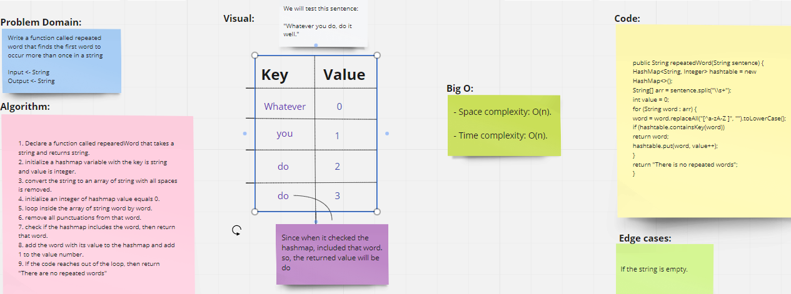
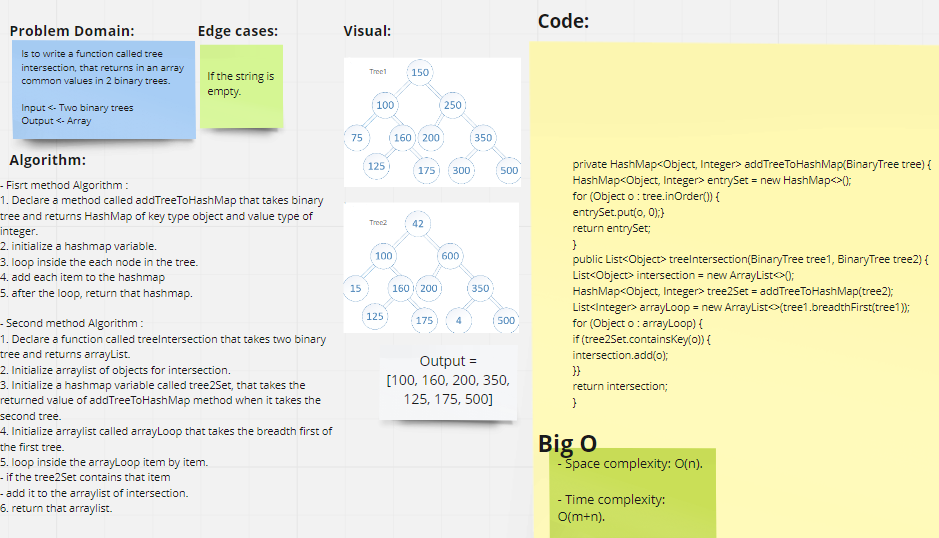

# 30. HashTable
A hash table (hash map) is a data structure that implements a hash table array, which maps keys to values. 

## Challenge
- **We asked to implement hashtable by Creating 2 classes with their basic methods:**
1. **Node class**
2. **HashTable Class**

## Approach & Efficiency
- **Space complexity** -> O(n).

- **Time complexity** ->
1. **hashCode** mehod -> O(1)
2. **getBucketIndex** mehod -> O(n)
3. **isEmpty** method -> O(1)
4. **add** method -> O(n)
5. **remove** method -> O(n)
6. **get** method (for search) -> O(n)

Because it could include more than one item point to the single cell

## API
### HashTable Class Methods:
1.  **hashCode(K key)** ->  hashes the key using built in java hash function
returns hashCode of the key
2.  **getBucketIndex(K key)** -> Gets the index of where the value is located in the bucket array.
returns bucketIndex.
3. **isEmpty()** -> checks if hashTable is empty
returns boolean.
4. **add(K key, V value)** -> adds the key/value pairs to the table.
5. **remove(K key)** -> remove the value from the table
returns deleted value.
6. **get(K key)** -> return the value from the table based on inserted key.

    
----
# In the next challanges we used hashmap

# 31. Find the first repeated word in a book

## Challenge Summary
<!-- Description of the challenge -->
Is to Write a function called **repeated word** that finds the first word to occur more than once in a string.

**Arguments:** string
**Return:** string

  
## [Link to the code](../challenges/hashTable/app/src/main/java/hashTable/hashmapChallenges/RepeatedWord.java)

## [Link to the test](../challenges/hashTable/app/src/test/java/hashTable/RepeatedWordTest.java)
  

## Whiteboard Process
<!-- Embedded whiteboard image -->

  
## Approach & Efficiency
<!-- What approach did you take? Why? What is the Big O space/time for this approach? -->
### - Approach:
1. Declare a function called repearedWord that takes a string and returns string.
2. initialize a hashtable variable with the key is string and value is integer.
3. convert the string to an array of string with all spaces is removed.
4. initialize an integer of hashtable value equals 0.
5. loop inside the array of string word by word.
6. remove all punctuations from that word.
7. check if the hashtable includes the word, then return that word.
8. add the word with its value to the table and add 1 to the value number.
9. If the code reaches out of the loop, then return "There are no repeated words"

  
### - Efficiency:
- **Space complexity** -> O(n), becuase I initialized Hashtable and array of string to solve this challenge.

- **Time complexity** -> O(n)

  
## Solution
<!-- Show how to run your code, and examples of it in action -->
- Initialize A variable from **RepeatedWord Class**.
- then call the **repeatedWord(sentence)** method.

  
---

# 32. Find common values in 2 binary trees.

## Challenge Summary
<!-- Description of the challenge -->
Write a function called **tree intersection**, that returns in an array common values in 2 binary trees.

**Arguments:** Two binary trees
**Return:** Array

  
## [Link to the code](../challenges/hashTable/app/src/main/java/hashTable/hashmapChallenges/TreeIntersection.java)

## [Link to the test](../challenges/hashTable/app/src/test/java/hashTable/TreeIntersectionTest.java)

## Whiteboard Process
<!-- Embedded whiteboard image -->

  
## Approach & Efficiency
<!-- What approach did you take? Why? What is the Big O space/time for this approach? -->
### - Approach:
#### **Fisrt method Algorithm :**

1. Declare a method called addTreeToHashMap that takes binary tree and returns HashMap of key type object and value type of integer.
2. initialize a hashmap variable.
3. loop inside the each node in the tree.
4. add each item to the hashmap
5. after the loop, return that hashmap.

#### **Second method Algorithm :**

1. Declare a function called treeIntersection that takes two binary tree and returns arrayList.
2. Initialize arraylist of objects for intersection.
3. Initialize a hashmap variable called tree2Set, that takes the returned value of addTreeToHashMap method when it takes the second tree.
4. Initialize arraylist called arrayLoop that takes the breadth first of the first tree.
5. loop inside the arrayLoop item by item.
- if the tree2Set contains that item
- add it to the arraylist of intersection.
6. return that arraylist.

  
### - Efficiency:
- **Space complexity** -> O(n)

- **Time complexity** -> O(m+n), where m and n are the number of nodes for each tree.

  
## Solution
<!-- Show how to run your code, and examples of it in action -->
- Initialize A variable from **TreeIntersection Class**.
- then call the **addTreeToHashMap(tree1, tree2)** method.

## Resources

1.  As for HashTable Class -Class-30.
2. [Regex used in Repeated Word Challenge](https://stackoverflow.com/questions/18830813/how-can-i-remove-punctuation-from-input-text-in-java)
