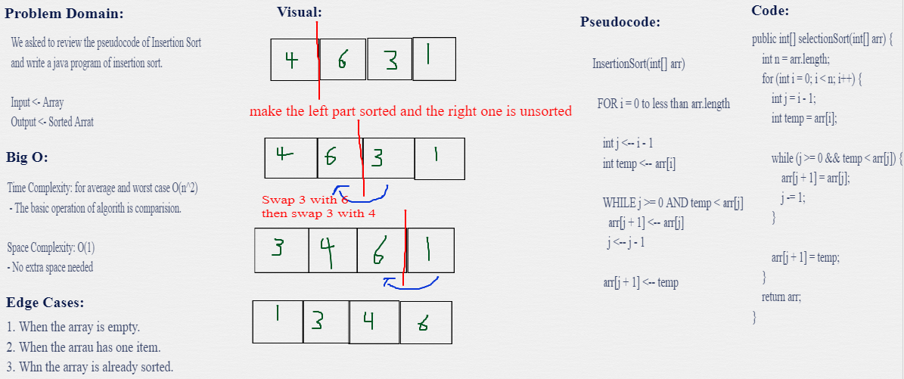

# Sorting Algorithms

- In computer science, a sorting algorithm is an algorithm that puts elements of a list into an order. 

# Insertion(Selection) Sort
Selection Sort is a sorting algorithm that traverses the array multiple times finding the ascending/descending order.

# Challenge Summary
<!-- Description of the challenge -->
 sorting an Array of elements from the beginning to end. 
 

## Whiteboard Process
<!-- Embedded whiteboard image -->

## Approach & Efficiency
<!-- What approach did you take? Why? What is the Big O space/time for this approach? -->
- **Time Complexity:** for average and worst case O(n^2) - The basic operation of algorith is comparision.

- **Space Complexity:** O(1) - No extra space needed

## Solution
<!-- Show how to run your code, and examples of it in action -->
You just need to call selectionSort method and insert your array.

# Resourses: 
1. [Sorting Algorithm](https://en.wikipedia.org/wiki/Sorting_algorithm).
2. [Insertion Sort - Video](https://www.youtube.com/watch?v=JecAk1FAOck).
3. [Insertion Sort - example document](https://codefellows.github.io/common_curriculum/data_structures_and_algorithms/Code_401/class-26/solutions/BLOG)