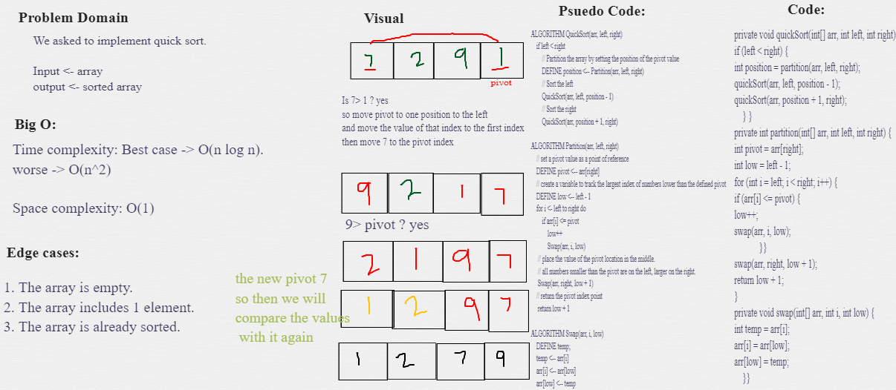

# Sorting Algorithms

- In computer science, a sorting algorithm is an algorithm that puts elements of a list into an order. 

---

## Insertion(Selection) Sort
Selection Sort is a sorting algorithm that traverses the array multiple times finding the ascending/descending order.

## Challenge Summary
<!-- Description of the challenge -->
 sorting an Array of elements from the beginning to end. 

## Pseudocode
```
  InsertionSort(int[] arr)

    FOR i = 1 to arr.length

      int j <-- i - 1
      int temp <-- arr[i]

      WHILE j >= 0 AND temp < arr[j]
        arr[j + 1] <-- arr[j]
        j <-- j - 1

      arr[j + 1] <-- temp
```

## Example steps
[8,4,23,42,16,15]

- We divide our array to 2 parts which is left and right.
### (1)
- The first step involves the first element.
[8|,4,23,42,16,15]

### (2)
- The second step involves the first 2 elements.  
[4,8|,23,42,16,15]
- so we ended up with the first two elements sorted.

### (3)
[4,8|,23,42,16,15]
[4,8,23|,42,16,15]
[4,8,23,42|,16,15]
[4,8,23,42,16|,15]
[4,8,23,16,42|,15]
[4,8,16,23,42|,15]
[4,8,16,23,15,42|]
[4,8,16,15,23,42|]
[4,8,15,16,23,42|]

And this is our final sorted array.

## Whiteboard Process
<!-- Embedded whiteboard image -->


## Approach & Efficiency
<!-- What approach did you take? Why? What is the Big O space/time for this approach? -->
- **Time Complexity:** for average and worst case O(n^2) - The basic operation of algorith is comparision.

- **Space Complexity:** O(1) - No extra space needed

## Solution
<!-- Show how to run your code, and examples of it in action -->
You just need to call selectionSort method and insert your array.

---

## Merge Sort
is a Divide and Conquer algorithm

## Challenge Summary
<!-- Description of the challenge -->
 sorting an Array of elements from the beginning to end using merge sort. 

## Pseudocode
```
 ALGORITHM Mergesort(arr)
    DECLARE n <-- arr.length

    if n > 1
      DECLARE mid <-- n/2
      DECLARE left <-- arr[0...mid]
      DECLARE right <-- arr[mid...n]
      // sort the left side
      Mergesort(left)
      // sort the right side
      Mergesort(right)
      // merge the sorted left and right sides together
      Merge(left, right, arr)

ALGORITHM Merge(left, right, arr)
    DECLARE i <-- 0
    DECLARE j <-- 0
    DECLARE k <-- 0

    while i < left.length && j < right.length
        if left[i] <= right[j]
            arr[k] <-- left[i]
            i <-- i + 1
        else
            arr[k] <-- right[j]
            j <-- j + 1

        k <-- k + 1

    if i = left.length
       set remaining entries in arr to remaining values in right
    else
       set remaining entries in arr to remaining values in left
```

## Example steps
[8,4,23,42,16,15]


## Whiteboard Process
<!-- Embedded whiteboard image -->


## Approach & Efficiency
<!-- What approach did you take? Why? What is the Big O space/time for this approach? -->
- **Time Complexity:** 

- **Space Complexity:** 

## Solution
<!-- Show how to run your code, and examples of it in action -->
You just need to call mergeSort method and insert your array.

----
## Quick Sort
QuickSort is a Divide and Conquer algorithm as well.
It picks an element as pivot and partitions the given array around the picked pivot. 

## Challenge Summary
<!-- Description of the challenge -->
 sorting an Array of elements from the beginning to end using quick sort. 

## Pseudocode
```
 ALGORITHM QuickSort(arr, left, right)
    if left < right
        // Partition the array by setting the position of the pivot value
        DEFINE position <-- Partition(arr, left, right)
        // Sort the left
        QuickSort(arr, left, position - 1)
        // Sort the right
        QuickSort(arr, position + 1, right)

ALGORITHM Partition(arr, left, right)
    // set a pivot value as a point of reference
    DEFINE pivot <-- arr[right]
    // create a variable to track the largest index of numbers lower than the defined pivot
    DEFINE low <-- left - 1
    for i <- left to right do
        if arr[i] <= pivot
            low++
            Swap(arr, i, low)

     // place the value of the pivot location in the middle.
     // all numbers smaller than the pivot are on the left, larger on the right.
     Swap(arr, right, low + 1)
    // return the pivot index point
     return low + 1

ALGORITHM Swap(arr, i, low)
    DEFINE temp;
    temp <-- arr[i]
    arr[i] <-- arr[low]
    arr[low] <-- temp
```

## Example steps
[8,4,23,42,16,15]

- We will assign **15** as **pivot**, and we will compare values with the pivot.

### (1)
[8,4,23,42,16,15]
- 8 <= 15 ?? yes

Swap(arr[i], arr[low])


## Whiteboard Process
<!-- Embedded whiteboard image -->


## Approach & Efficiency
<!-- What approach did you take? Why? What is the Big O space/time for this approach? -->
- **Time Complexity:** Best case, O(n log n)  n steps to partition the array, log n times.
worse O(n^2)

- **Space Complexity:** O(1) - Since, it only swaps elements within the array

## Solution
<!-- Show how to run your code, and examples of it in action -->
You just need to call quickSort method and insert your array.


# Resourses: 
1. [Sorting Algorithm](https://en.wikipedia.org/wiki/Sorting_algorithm).
2. [Insertion Sort - Video](https://www.youtube.com/watch?v=JecAk1FAOck).
3. [Insertion Sort - example document](https://codefellows.github.io/common_curriculum/data_structures_and_algorithms/Code_401/class-26/solutions/BLOG)
4. 
5. [Quick Sort](https://www.geeksforgeeks.org/quick-sort/)

