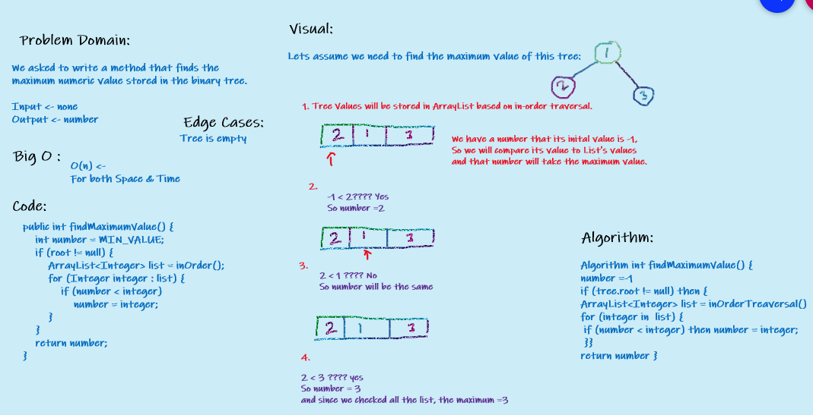
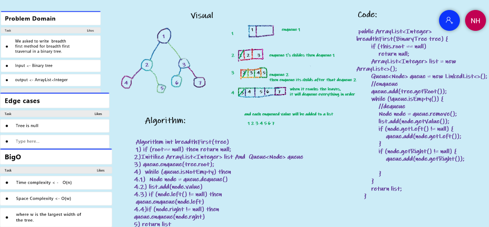

# 15. Trees
<!-- Short summary or background information -->
A tree is a nonlinear data structure,  
and here the basic functionality of Binary Trees, and Binary Search Trees using java is covered.

## Challenge
<!-- Description of the challenge -->
- **We asked to Create 3 classes :**
1. **Node class**
2. **Binary Tree class**, with pre-order, in-order, and post-order methods.
3. **Binary Search Tree class**, with **Add** and **contains** methods.
  
## Approach & Efficiency
<!-- What approach did you take? Why? What is the Big O space/time for this approach? -->
### 1. Binary Trees
- The Big O time complexity for inserting a new node and Searching <- is O(n).

- The Big O space complexity for a node insertion using breadth first insertion will be O(w), where w is the largest width of the tree.

### 2. Binary Search Trees
- The Big O time complexity of a Binary Search Tree’s insertion and search operations is O(h), or O(height). 

- The Big O space complexity of a BST search would be O(1).

## API
<!-- Description of each method publicly available in each of your trees -->
- In **Binary Tree** class we have 3 traversals methods, return an array of the values, ordered appropriately.
1. pre order
2. in order
3. post order. 

- In **Binary Search Tree** class we have 2 methods:
1. **Add**  
Arguments: value  
Return: nothing  
Adds a new node with that value in the correct location in the binary search tree.
     
2. **Contains**  
Argument: value  
Returns: boolean indicating whether or not the value is in the tree at least once.

## Source:
- [Contains method algorithm](https://www.baeldung.com/cs/binary-search-trees)

---
# 16. Tree Max

# Challenge Summary
<!-- Description of the challenge -->
We asked to write a method that finds the maximum numeric value stored in the binary tree. 
- Method: **findMaximumValue()**
- Arguments: none
- Returns: number

## Whiteboard Process
<!-- Embedded whiteboard image -->

## Approach & Efficiency
<!-- What approach did you take? Why? What is the Big O space/time for this approach? -->
O(n) because it checks the value for each node.

## Solution
<!-- Show how to run your code, and examples of it in action -->
- Initilize A tree variable from **BinaryTree Class**.
- then call the **findMaximumValue()** method.

---
# 17. Breadth First

# Challenge Summary
<!-- Description of the challenge -->
We asked to write  breadth first method for breadth first traversal in a binary tree.
- Method: **breadthFirst(tree)**
- Arguments: tree
- Returns: list of all values in the tree, in the order they were encountered

## Whiteboard Process
<!-- Embedded whiteboard image -->

## Approach & Efficiency
<!-- What approach did you take? Why? What is the Big O space/time for this approach? -->
- The Big O time complexity -> O(n).

- The Big O space complexity -> be O(w), where w is the largest width of the tree.

## Solution
<!-- Show how to run your code, and examples of it in action -->
- Initilize A tree variable from **BinaryTree Class**.
- then call the **breadthFirst(tree)** method.

# Resources:
[BreadthFirst](https://www.baeldung.com/java-binary-tree)

---
# 18. Tree Fizz Buzz

# Challenge Summary
<!-- Description of the challenge -->
We asked to create method that checks K ary tree nodes' values- Method: **treeFizzBuzz(tree)**
1. If the values divisible by 3, change it to 'Fizz'.
2. Divisible by 5, change it to 'Buzz'.
3. By both 3&5, change it to 'FizzBuzz'.
4. Else, just convert the value to string.

- Arguments: tree<Integer>
- Returns: tree<String>

## Whiteboard Process
<!-- Embedded whiteboard image -->

## Approach & Efficiency
<!-- What approach did you take? Why? What is the Big O space/time for this approach? -->
- The Big O time complexity -> O(n).

- The Big O space complexity -> be O(w), where w is the largest width of the tree.

## Solution
<!-- Show how to run your code, and examples of it in action -->
- Initialize A tree variable from **KAryTree Class**.
- then call the **treeFizzBuzz(tree)** method.

